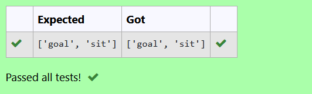

# Regex in Python: Filter Words Without the Letter 'e'

## NAME: SANTHOSH T
## REG NO: 212223220100


## 🎯 Aim
To write a Python program that filters out and returns all elements from a list **that do not contain the letter `'e'`**, using **regular expressions (regex)**.

## 🧠 Algorithm
1. Import the `re` module.
2. Initialize an empty list `l1` to store results.
3. Define a list of words:  
   `items = ['goal', 'new', 'user', 'sit', 'eat', 'dinner']`
4. Iterate through each word in the list:
   - Use `re.search(r"e", i)` to check if the word contains `'e'`.
   - If **not**, append the word to `l1`.
5. Print the final filtered list.

## 🧾 Program
```py
import re
l1 = []
items = ['goal', 'new', 'user', 'sit', 'eat', 'dinner']
for i in items:
    if not re.search(r"e", i):
        l1.append(i)
print("Words without 'e':", l1)

```
## Output



## Result
Thus the program executed successfully.


