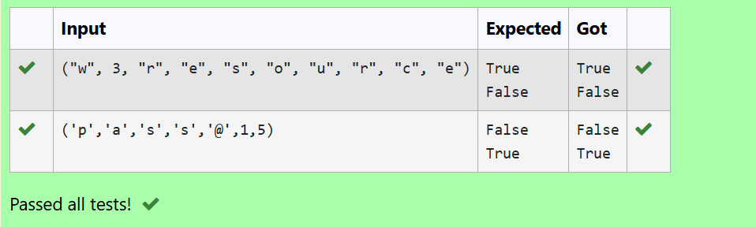

# Tuple in Python: Check Element Existence
## NAME: SANTHOSH T
## REG NO: 212223220100

## 🎯 Aim
To write a Python program that checks if the element `'n'` and the element `8` exist within a given tuple.

## 🧠 Algorithm
1. Define a tuple `x` with some letters and numbers.
2. Use the `in` operator to check if the string `'n'` exists within the tuple.
3. Use the `in` operator to check if the integer `8` exists within the tuple.
4. Print the results.

## 🧾 Program
```py
tuplex = input()
print("n" in tuplex)
print("8" in tuplex)
```
## Output




## Result
Thus the program executed successfully.


